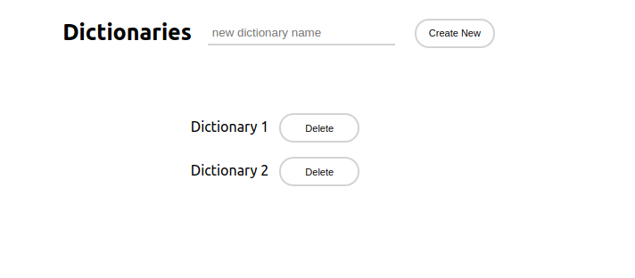
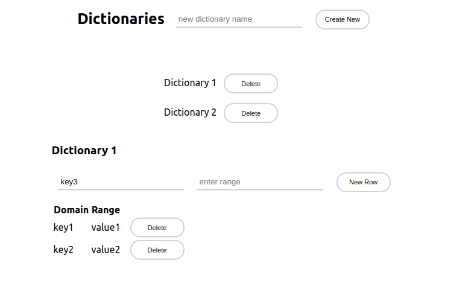

# React Dictionary Management

Create and delete a dictionaries, displaying a list of current dictionaries. When click on an available dictionary it will display input to insert a new row (key/value) and the existing rows (if any). Rows can be updated and deleted.

Row inputs with validation.

 ## The App was built with: 
 React, Javascript, CSS and HTML.

Image1

 

Image2

 
